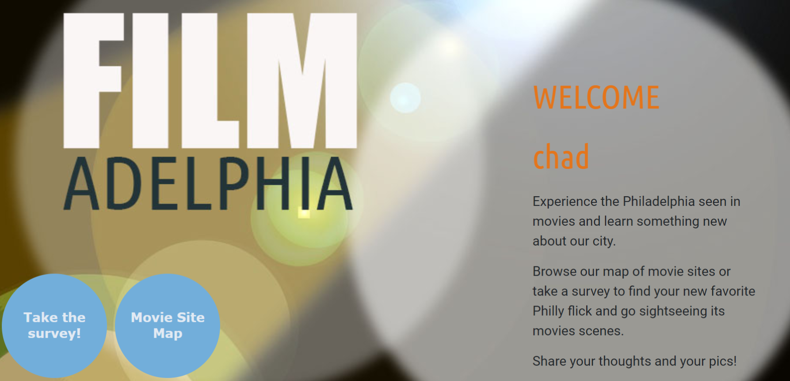

# Filmadelphia
Project 2

---

**Overview**

A user would sign up and fill a survey that will determine a movie based on their survey responses. A map of Philadelphia is populated with film locations where scenes from the movie were shot, as well as accompanying movie trivia related to the location. The objective is to popularize these locations related to the movie and revitalize the city through local tourism. 

---

**Technologies used**
```
- MySQL database
- Node.js
- Bootstrap
- Express.js
- Sequelize with Node MySQL2
- MapboxGL.js (map visualization)
- Passport.js (user authentication and login)
- dotenv (password protection and remove node_modules folder)
- Heroku (deployment)
```
---

**Link to Site**
https://filmadelphia.herokuapp.com/

---

**Screenshots of deployed website**


---

**New technology or feature we haven't discussed**
MapBox is an open-source mapping service to generate customizable maps. A GeoJSON Feature object is used to represent a location associated with a movie.